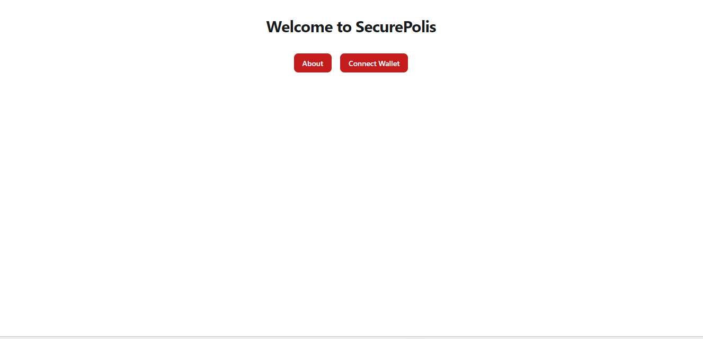
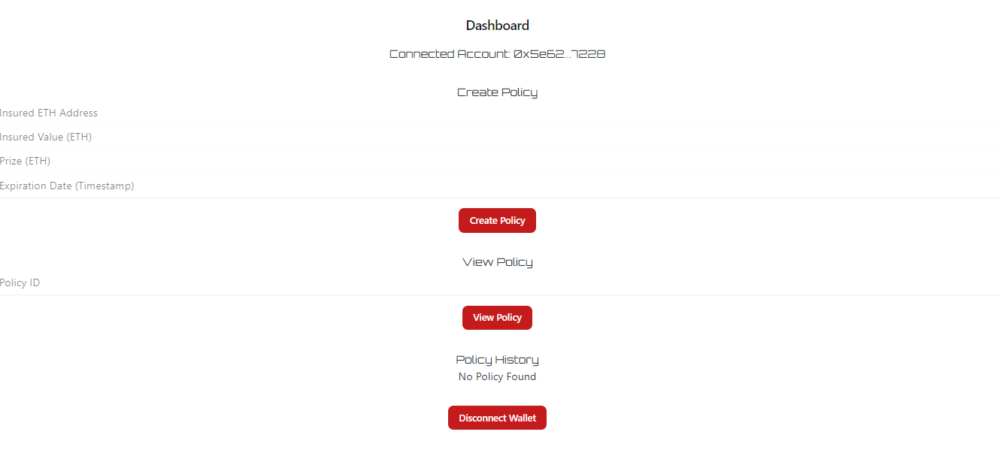

# **SecurePolis - Decentralized Insurance Platform**

**SecurePolis** is a decentralized insurance platform built on the Ethereum blockchain. The application allows users to create, view, and manage insurance policies through their connected MetaMask wallet. It provides a streamlined interface for both insurers and insured parties to interact securely and transparently.

## **Table of Contents**

- [Project Overview](#project-overview)
- [Technologies Used](#technologies-used)
- [Features](#features)
- [Prerequisites](#prerequisites)
- [Installation](#installation)

## **Project Overview**

SecurePolis leverages blockchain technology to eliminate inefficiencies in traditional insurance systems. The platform ensures:

- **Transparency**: All interactions are recorded on the blockchain.
- **Security**: Immutable records of policies and claims.
- **Automation**: Smart contracts handle policy creation, premium payments, and claims.

Users must connect their MetaMask wallet to use the platform. The insurer can create policies, while the insured can view their policies and file claims.

## **Technologies Used**

- **Frontend**: React.js with Material UI (Joy UI) for the interface.
- **Blockchain**: Solidity for writing smart contracts.
- **Ethereum Network**: Using the Sepolia test network via Infura.
- **Wallet**: MetaMask for connecting and interacting with the blockchain.
- **Ethers.js**: Library for interacting with the Ethereum blockchain.
- **Hardhat**: Development environment for compiling and deploying Solidity contracts.

## **Features**

- **MetaMask Integration**: Users must connect their MetaMask wallet to interact with the platform.
- **Policy Creation**: Insurers can create new policies, defining the insured party, premium, insured amount, and expiration date.
- **View Policies**: Users can view their created or owned policies.
- **File Claims**: Insured parties can file claims on active policies.
- **Policy History**: A history of created policies is displayed in the dashboard.

## **Prerequisites**

To run this project, you need to have the following installed:

1. **Node.js** (v14+)
2. **MetaMask** extension installed in your browser.
3. **Infura** account for connecting to the Sepolia testnet.

## **Installation**

### 1. **Clone the Repository**

```bash
git clone https://github.com/your-username/securepolis.git
cd securepolis

## *Screenshots*





